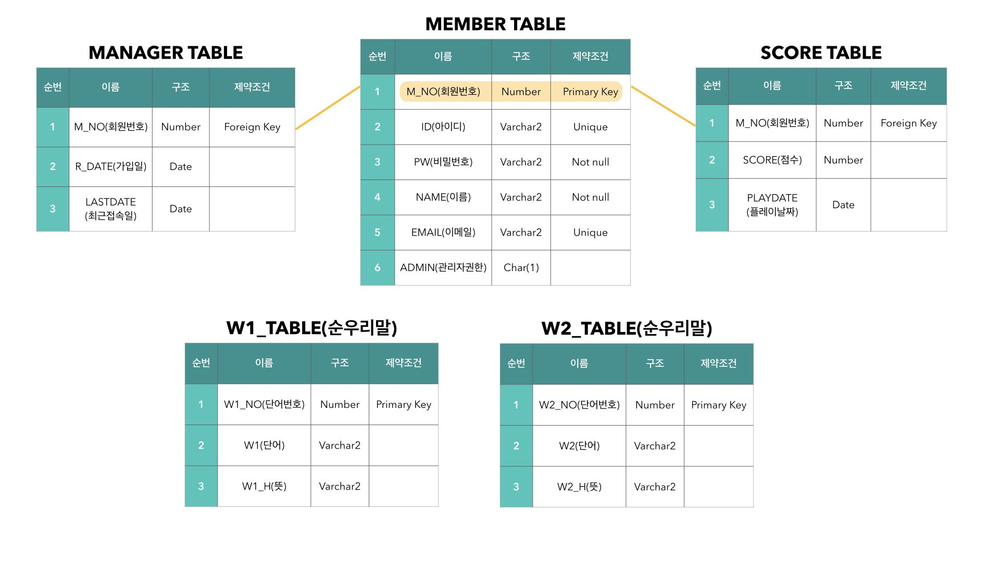

# JAVA Mini Project(프로젝트 이름)
## 프로젝트 개요
## 사용 언어

## 개발자(GIT 계정)
서연운 ([yws9612](https://github.com/yws9612))  
이송이 ([nonameleel](https://github.com/nonameleel))  
황용학 ([yonghyng](https://github.com/YONGHYNG))  
문종주 ([admoonistrator](https://github.com/admoonistrator))  
최서영 ([seoyoung](https://github.com/seoyoung1029))  
이윤경 ([yiyk7](https://github.com/yiyk7))  

## **데이터 테이블**

## **JavaSwingUI**

